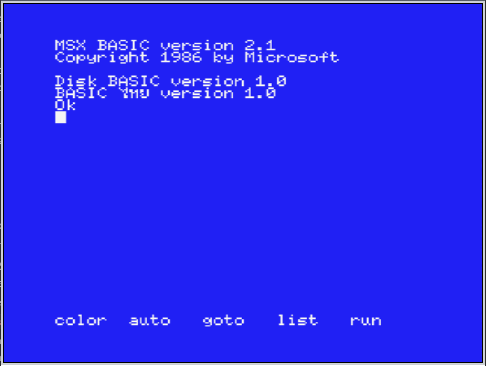
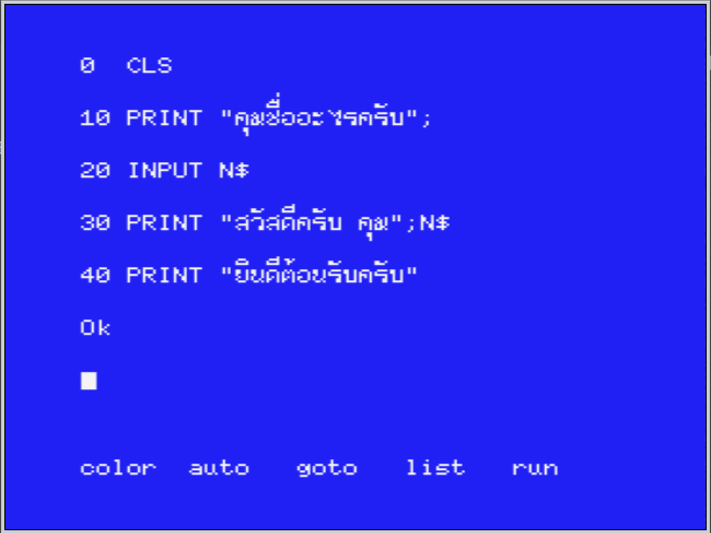
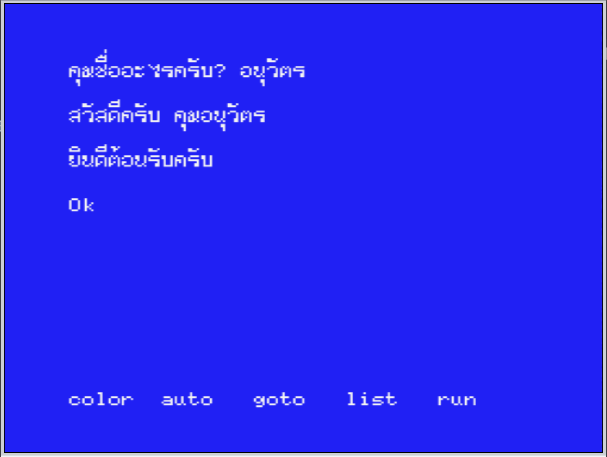
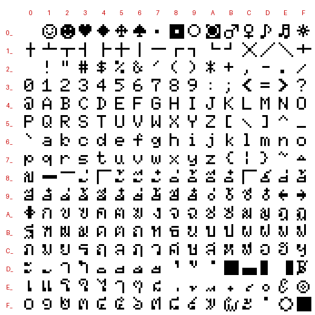

# thaimsx — BASIC ไทย สำหรับ MSX1 / MSX2 / MSX2+

[English summary](#english-summary) · [ดาวน์โหลด ROM](https://github.com/too101/thaimsx/releases/latest)

ROM ตลับ (8 KB) ที่เพิ่มภาษาไทยให้ MSX BASIC: แสดงอักษรไทย 3 ระดับ (สระบน–พยัญชนะ–สระล่าง), พิมพ์ไทยด้วยแป้นเกษมณี,
ภาษาไทยบนจอกราฟิก และพิมพ์ออกเครื่องพิมพ์ ใช้ได้ทั้ง MSX1, MSX2 และ MSX2+ (รวมเครื่องที่ต่อ disk drive)

| เปิดเครื่อง (MSX2 + disk) | โปรแกรมภาษาไทย (PRINTON) | ผลการ RUN |
|---|---|---|
|  |  |  |

## ที่มา

- **สร้างใหม่ทั้งหมด** โดยอ้างอิงฟังก์ชันจาก ROM **MSX-ไทย Version 1.02, Copyright 1988 by V. Oucharearn & Kawi Co. Ltd.**
  ซึ่งใช้ได้กับ MSX1 เท่านั้น (บน MSX2/MSX2+ ตัวอักษรเพี้ยน, ค้าง, โหมดแสดงผล 3 ระดับใช้ไม่ได้) — โค้ดใหม่เรียกเฉพาะ
  BIOS/ตัวแปรระบบที่เป็นมาตรฐาน ไม่แก้ stack ของ BIOS แบบต้นฉบับ จึงทำงานได้ทุกรุ่น
- **ฟอนต์** จาก MSX-ไทย ปรับตำแหน่งวรรณยุกต์ (ชิดล่างของช่อง เพื่อให้อยู่ใกล้พยัญชนะเมื่อวาดในแถวบน) และพินทุ
- **แก้ bug แป้นพิมพ์** ให้ถูกต้องตามแป้นเกษมณี
- **ลดขนาดให้เหลือ 8 KB** จาก 16 KB ของต้นฉบับ
- repo นี้ไม่มี ROM ต้นฉบับ

<details><summary>ฟอนต์ไทยทั้งชุด</summary>



</details>

## ใช้งาน

ดาวน์โหลดไฟล์ ROM (8 KB) จากหน้า [Releases](https://github.com/too101/thaimsx/releases) (ชื่อเวอร์ชันเป็นวันที่ เช่น `v20260925`)
— ใส่เป็น cartridge ใน emulator (blueMSX / openMSX) หรือเขียนลงตลับจริง (ROM 8 KB ที่ $4000) หรือ build เองจาก source

เปิดเครื่องแล้วระบบไทยเปิดเอง ขึ้นข้อความ `BASIC ไทย version 1.0` (กดปุ่ม **CODE** ค้างตอนเปิดเครื่อง = เข้า BASIC ปกติ)

### คำสั่ง CALL ทั้งหมด

| คำสั่ง | ย่อ | ทำอะไร |
|---|---|---|
| `CALL THAION` | | เปิดระบบไทย (ฟอนต์ไทย, แป้นไทย, hook ทั้งหมด) แล้วพิมพ์ข้อความเวอร์ชัน — ไม่ล้างจอ |
| `CALL THAIOFF` | | ปิดระบบไทย คืนฟอนต์อังกฤษบนจอ (ไม่ล้างจอ) และแป้นอังกฤษ |
| `CALL PRINTON` | `CALL ?ON` | แสดงผลไทย 3 ระดับ (บรรทัดละ 3 แถว: สระบน/วรรณยุกต์ – พยัญชนะ – สระล่าง) ล้างจอเมื่อสลับโหมด |
| `CALL PRINTOFF` | `CALL ?OFF` | แสดงผลแถวเดียว ล้างจอเมื่อสลับโหมด |
| `CALL INPUTON` | `CALL @ON` | แป้นพิมพ์เป็นภาษาไทย |
| `CALL INPUTOFF` | `CALL @OFF` | แป้นพิมพ์เป็นภาษาอังกฤษ |
| `CALL PLOCKON` | | ล็อกโหมดแสดงผล — PRINTON/PRINTOFF และปุ่ม SELECT ไม่มีผล |
| `CALL PLOCKOFF` | | ปลดล็อก |
| `CALL SYSTEM` | | แสดงข้อความเวอร์ชัน |
| `CALL ANSTR(<สตริง>,<ตัวแปร$>)` | | แปลงเลขไทย ๐–๙ เป็นเลขอารบิก 0–9 |
| `CALL TNSTR(<สตริง>,<ตัวแปร$>)` | | แปลงเลขอารบิก 0–9 เป็นเลขไทย ๐–๙ |
| `CALL MLSTR(<สตริง>,<ตัวแปร$>)` | | ตัดสระบน สระล่าง วรรณยุกต์ออก เหลือเฉพาะตัวแถวกลาง |
| `CALL LPRINT` | | ตั้งเครื่องพิมพ์สำหรับพิมพ์ไทย 3 แถว (ขอบซ้าย 0, ขอบขวา 80, ระยะบรรทัด 8/72") |
| `CALL LPRINT("<n>")` | | เหมือนข้างบน กำหนดความกว้างบรรทัด n = 1–135 |

ตัวอย่าง:
```basic
10 CALL TNSTR("2567",A$):PRINT A$        ' ๒๕๖๗
20 CALL ANSTR(A$,B$):PRINT VAL(B$)+1      ' 2568
30 CALL MLSTR("สวัสดี",C$):PRINT LEN(C$)  ' 4
```

### แป้นพิมพ์

| ปุ่ม | ผล |
|---|---|
| **CODE** | สลับพิมพ์ไทย/อังกฤษ (ไฟ LED และ cursor กระพริบเมื่อเป็นไทย) |
| **CAPS** (เมื่อพิมพ์ไทย) | ล็อก Shift ไทย — พิมพ์ตัวแถวบนได้โดยไม่ต้องกด Shift |
| **SELECT** | สลับ PRINTON / PRINTOFF (ล้างจอ) |
| **Enter** ใน direct mode | ส่งบรรทัดแล้วกลับเป็นอังกฤษเอง (ตอบ INPUT ในโปรแกรมไม่สลับ) |
| **GRAPH + A–Z** | พิมพ์คำสั่ง BASIC ทั้งคำ (ดูตารางด้านล่าง) |
| **GRAPH + SHIFT + A–Z** | พิมพ์คำสั่ง BASIC ชุดที่สอง (ดูตารางด้านล่าง) |
| ปุ่ม `_` ค้าง + J | ๅ |
| ปุ่ม `_` ค้าง + Shift + O | ฦๅ |
| Shift + แป้น ง | `.` |
| Shift + 7 | ฿ |

พินทุ (ฺ) ไม่มีแป้น ใช้ `CHR$(218)`

#### ปุ่ม GRAPH — พิมพ์คำสั่ง BASIC ด้วยปุ่มเดียว

กด **GRAPH** ค้างแล้วกดตัวอักษร จะได้คำสั่ง BASIC ทั้งคำพร้อมวงเล็บ/เครื่องหมายที่ต้องใช้ต่อ (เช่น GRAPH+C = `CHR$(`)
กด **GRAPH + SHIFT** ได้ชุดที่สอง — ชุดคำเดียวกับ MSX-ไทย 1.02 ต้นฉบับ

- ใช้ได้ตลอดที่ระบบไทยเปิด (`CALL THAION`) ไม่ว่าจะพิมพ์ไทยหรืออังกฤษอยู่ และใช้ได้ทั้ง PRINTON/PRINTOFF
- GRAPH + ปุ่มอื่นที่ไม่ใช่ A–Z (ตัวเลข, เครื่องหมาย) และ CTRL + GRAPH ได้รหัสตามปกติของ MSX — แต่รหัส 128–255
  จะแสดงเป็นอักษรไทยเพราะใช้ฟอนต์ไทยแทนที่ (เช่น GRAPH+1 ได้รหัส 172 ซึ่งแสดงเป็น ฌ)
- `CALL THAIOFF` แล้ว GRAPH กลับเป็นอักษรกราฟิกของ MSX ทั้งหมด

| ปุ่ม | GRAPH | GRAPH+SHIFT | ปุ่ม | GRAPH | GRAPH+SHIFT |
|---|---|---|---|---|---|
| A | `ASC(` | `AND` | N | `NEXT` | `NOT` |
| B | `BIN$(` | `BASE(` | O | `OPEN` | `OR` |
| C | `CHR$(` | `CLS` | P | `POKE` | `PEEK(` |
| D | `DATA` | `DIM` | Q | `SOUND` | `PLAY` |
| E | `ELSE` | `PSET` | R | `READ` | `RETURN` |
| F | `FOR` | `FILES` | S | `SCREEN` | `SPRITE` |
| G | `GOTO` | `GOSUB` | T | `THEN` | `TAB(` |
| H | `HEX$(` | `PRESET` | U | `USR(` | `USING` |
| I | `IF` | `INKEY$` | V | `VPOKE` | `VPEEK(` |
| J | `INPUT` | `INT(` | W | `WIDTH` | `VAL(` |
| K | `KEY` | `KILL"` | X | `XOR` | `LOCATE` |
| L | `LEFT$(` | `LINE` | Y | `CIRCLE` | `BLOAD` |
| M | `MID$(` | `MAXFILES = ` | Z | `PAINT` | `BSAVE` |

### ความสามารถอื่น

- **PRINTON**: เก็บสระบน/ล่างลงโปรแกรมครบเมื่อแก้บรรทัดบนจอ, บรรทัดยาวต่อแถวแบบ 3 ชั้น, BS/DEL ลบพร้อมสระ, INS แทรก,
  ลูกศรขึ้น/ลงทีละ 3 แถว, สระบน+วรรณยุกต์ผสมเป็นตัวเดียว, ใช้ได้ทั้ง 40/80 คอลัมน์ และ SCREEN 1
- **จอกราฟิก** (SCREEN 2–8): `OPEN "GRP:" AS #1 : PRINT #1,"ภาษาไทย"` ได้ตัวไทยพร้อมสระ/วรรณยุกต์ 3 ระดับ
  (เว้นบรรทัดละ 24 จุดด้วย PRESET)
- **เครื่องพิมพ์**: ตอน PRINTON, LPRINT/LLIST พิมพ์บรรทัดละ 3 แถวแบบต้นฉบับ (สำหรับเครื่องพิมพ์ที่มีชุดอักษรไทยเดียวกับจอ)
- **disk**: ทำงานร่วมกับ Disk BASIC / MSX-DOS ได้ทุกลำดับ slot
- RAM: จองต่อจาก HIMEM 235 ไบต์ (Bytes free บน MSX1 = 28580)

## Build

ต้องมี [pasmo](https://pasmo.speccy.org/) และ python3
```
./build.sh          # -> build/thairom.rom (8192 ไบต์) ไฟล์เดียวกับที่แจกใน Releases
```

## ทดสอบ

ใช้ openMSX แบบไม่มีหน้าจอ ดูวิธีติดตั้งเครื่องจำลองที่ [`openmsx_machines/README.md`](openmsx_machines/README.md)
```
scripts/run_tests.sh      # ผลแต่ละเทสอยู่ใน out/, เทียบผลเครื่องพิมพ์กับ tests/t_prn_expected.prn
```

## โครงสร้าง

| path | |
|---|---|
| `src/` | source Z80 (pasmo) — `main.asm` รวมทุกไฟล์ |
| `assets/font_raw.bin` | ฟอนต์ไทย 255 ตัว × 8 ไบต์ |
| `docs/screenshots/` | ภาพหน้าจอ |
| `tests/` | สคริปต์ทดสอบ openMSX (TCL), `tests/legacy/` ชุดทดสอบช่วงแรก |
| `docs/DEV_NOTES_TH.md` | บันทึกการพัฒนา การวิเคราะห์ ROM ต้นฉบับ และบั๊กที่แก้ทีละข้อ |

## English summary

**thaimsx** is an 8 KB cartridge ROM that adds Thai to MSX BASIC on **MSX1, MSX2 and MSX2+** (with or without a disk drive).

- A new implementation modelled on the functions of *MSX-ไทย Version 1.02, © 1988 V. Oucharearn & Kawi Co. Ltd.*, which
  only works on MSX1. This code uses standard BIOS entries and system variables only, so it runs on every generation.
  The original ROM is not included in this repository.
- Font taken from MSX-ไทย with tone marks and phinthu repositioned; keyboard bugs fixed to match the Kedmanee layout;
  size reduced from 16 KB to 8 KB.
- Thai is enabled at power-on (hold **CODE** while booting to skip). **CODE** toggles Thai/English typing.
- 3-level display (`CALL PRINTON`): each line uses three screen rows (upper vowels/tone marks, consonants, lower vowels);
  lines edited on screen are stored back into the program with all marks. Works in 40/80 columns and SCREEN 1.
- Thai text on graphic screens (`OPEN "GRP:"`), and 3-row Thai printing on printers with the same Thai character set.
- **GRAPH + A–Z** / **GRAPH + SHIFT + A–Z** type whole BASIC keywords (table above).

| Command | Short | Action |
|---|---|---|
| `CALL THAION` / `CALL THAIOFF` | | Thai system on (font, keyboard, hooks) / off (English font and keyboard back) |
| `CALL PRINTON` / `CALL PRINTOFF` | `?ON` / `?OFF` | 3-level Thai display / single-row display (clears the screen) |
| `CALL INPUTON` / `CALL INPUTOFF` | `@ON` / `@OFF` | Thai / English keyboard |
| `CALL PLOCKON` / `CALL PLOCKOFF` | | Lock / unlock the display mode (SELECT key and PRINTON/OFF ignored) |
| `CALL SYSTEM` | | Show the version banner |
| `CALL ANSTR(s$,v$)` / `CALL TNSTR(s$,v$)` | | Thai digits → Arabic digits / Arabic → Thai digits |
| `CALL MLSTR(s$,v$)` | | Strip upper/lower vowels and tone marks (middle row only) |
| `CALL LPRINT` / `CALL LPRINT("n")` | | Set up the printer for 3-row Thai (line width n = 1–135) |

**Download** the ROM from [Releases](https://github.com/too101/thaimsx/releases). **Build**: `./build.sh` (needs pasmo and python3).
**Tests**: `scripts/run_tests.sh` (headless openMSX, see `openmsx_machines/README.md`).
